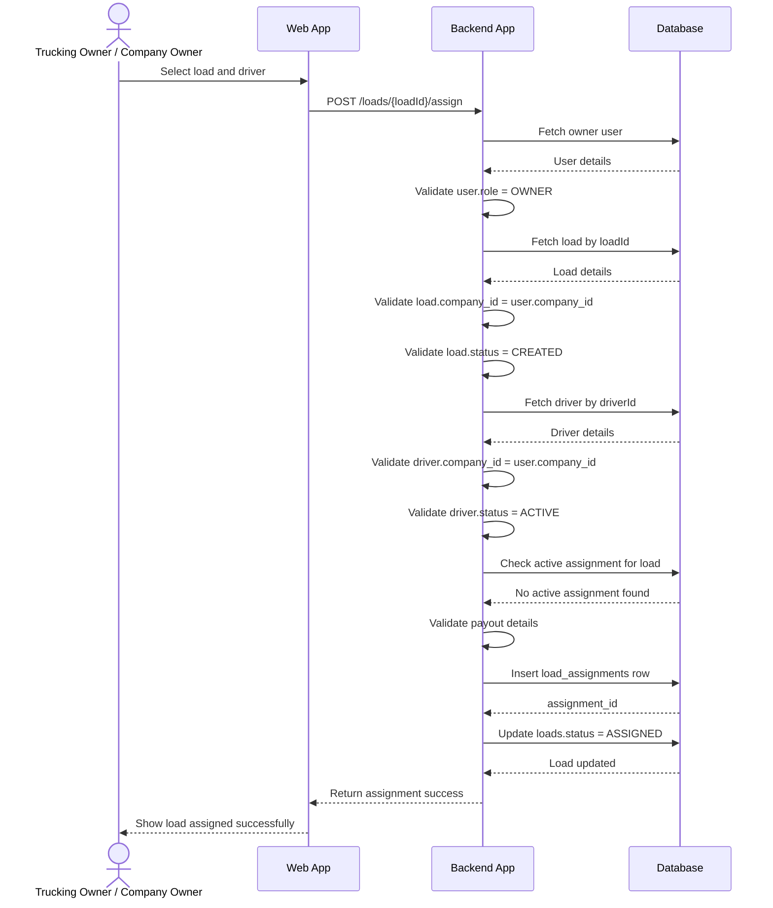

# Feature Spec: Owner Assigns Load to Driver

## Functional Requirement

Trucking owner / company owner can assign an approved load to a driver or owner-operator.

The owner is the same `OWNER` user who uploaded and approved the load document in the previous feature.

## Key Design Rule

A load can be assigned only after it exists as a final business record in the `loads` table.

```text
Load document uploaded
→ Owner reviews/approves extracted load data
→ Backend creates load
→ Owner assigns load to driver
```

## Tables Used

- `users`
- `companies`
- `drivers`
- `loads`
- `load_assignments`

## Required DB Schema Update

Update `load_assignments` to include:

```sql
assigned_by_user_id BIGINT REFERENCES users(id),
payout_type VARCHAR(50) NOT NULL,
notes TEXT
```

Recommended table:

```sql
CREATE TABLE load_assignments (
    id BIGSERIAL PRIMARY KEY,
    load_id BIGINT NOT NULL REFERENCES loads(id),
    driver_id BIGINT NOT NULL REFERENCES drivers(id),
    assigned_by_user_id BIGINT REFERENCES users(id),

    payout_type VARCHAR(50) NOT NULL,
    driver_pay_amount DECIMAL(12,2),
    driver_pay_percentage DECIMAL(5,2),

    assignment_status VARCHAR(50) DEFAULT 'ASSIGNED',
    notes TEXT,

    assigned_at TIMESTAMP DEFAULT CURRENT_TIMESTAMP,
    completed_at TIMESTAMP
);
```

## Statuses

### Load Status

```text
CREATED
ASSIGNED
IN_PROGRESS
DELIVERED
COMPLETED
CANCELLED
```

For this feature:

```text
Before assignment: loads.status = CREATED
After assignment:  loads.status = ASSIGNED
```

### Assignment Status

```text
ASSIGNED
CANCELLED
COMPLETED
```

Future statuses:

```text
ACCEPTED
REJECTED
```

## Payout Types

```text
FLAT_AMOUNT
PERCENTAGE
```

## Main Flow

1. Owner opens created/unassigned loads.
2. Owner selects a load.
3. Owner selects a driver or owner-operator.
4. Owner enters payout details:
   - flat amount, or
   - percentage of gross load revenue
5. Backend validates owner, load, driver, and payout.
6. Backend creates `load_assignments` row.
7. Backend updates `loads.status = ASSIGNED`.
8. Driver can now see assigned load.

## API

```http
POST /api/v1/loads/{loadId}/assign
Content-Type: application/json
Authorization: Bearer <token>
```

### Request: Flat Amount

```json
{
  "driverId": 45,
  "payoutType": "FLAT_AMOUNT",
  "driverPayAmount": 1000.00,
  "notes": "Driver will handle pickup and delivery."
}
```

### Request: Percentage

```json
{
  "driverId": 45,
  "payoutType": "PERCENTAGE",
  "driverPayPercentage": 40.00,
  "notes": "Owner operator gets 40% of gross load revenue."
}
```

### Success Response

```json
{
  "loadId": 301,
  "assignmentId": 9001,
  "driverId": 45,
  "loadStatus": "ASSIGNED",
  "assignmentStatus": "ASSIGNED",
  "message": "Load assigned successfully."
}
```

## Backend Steps

```text
assignLoadToDriver(loadId, request, userId):

1. Fetch authenticated user.
2. Validate user.role = OWNER.
3. Fetch load by loadId.
4. Validate load belongs to user's company.
5. Validate load.status = CREATED.
6. Fetch driver by request.driverId.
7. Validate driver belongs to same company.
8. Validate driver.status = ACTIVE.
9. Check there is no active assignment for this load.
10. Validate payout details.
11. Insert row into load_assignments.
12. Update loads.status = ASSIGNED.
13. Return assignment details.
```

## Payout Validation

### If payoutType = FLAT_AMOUNT

Required:

```text
driverPayAmount
```

Rules:

```text
driverPayAmount > 0
driverPayPercentage must be null
```

Optional warning:

```text
driverPayAmount > load.gross_revenue
```

Do not block this in MVP unless the business wants strict validation.

### If payoutType = PERCENTAGE

Required:

```text
driverPayPercentage
```

Rules:

```text
driverPayPercentage > 0
driverPayPercentage <= 100
driverPayAmount must be null
```

Driver pay calculation:

```text
driverPay = loads.gross_revenue * driverPayPercentage / 100
```

## Sequence Diagram



## DB Write Pattern

Insert assignment:

```sql
INSERT INTO load_assignments (
    load_id,
    driver_id,
    assigned_by_user_id,
    payout_type,
    driver_pay_amount,
    driver_pay_percentage,
    assignment_status,
    notes,
    assigned_at
)
VALUES (
    :loadId,
    :driverId,
    :ownerUserId,
    :payoutType,
    :driverPayAmount,
    :driverPayPercentage,
    'ASSIGNED',
    :notes,
    CURRENT_TIMESTAMP
);
```

Update load:

```sql
UPDATE loads
SET status = 'ASSIGNED',
    updated_at = CURRENT_TIMESTAMP
WHERE id = :loadId;
```

## Validations

- User must be authenticated.
- User role must be `OWNER`.
- Load must belong to user's company.
- Load status must be `CREATED`.
- Driver must belong to user's company.
- Driver status must be `ACTIVE`.
- Load must not already have an active assignment.
- Payout type must be valid.
- Payout value must match payout type.

## Active Assignment Check

For MVP, one load can have only one active assignment.

Active statuses:

```text
ASSIGNED
ACCEPTED
IN_PROGRESS
```

Example query:

```sql
SELECT id
FROM load_assignments
WHERE load_id = :loadId
  AND assignment_status IN ('ASSIGNED', 'ACCEPTED', 'IN_PROGRESS');
```

If a row exists, reject assignment.

## Edge Cases

### Load Already Assigned

```json
{
  "message": "Load is already assigned to a driver."
}
```

### Load Not Ready

```json
{
  "message": "Load is not ready for assignment."
}
```

### Driver Inactive

```json
{
  "message": "Selected driver is not active."
}
```

### Driver Belongs to Another Company

```json
{
  "message": "Driver does not belong to your company."
}
```

### Invalid Payout

```json
{
  "message": "Invalid payout details for selected payout type."
}
```

## Implementation Notes

- Assignment should happen inside a DB transaction.
- Insert `load_assignments` and update `loads.status` atomically.
- Use row locking or optimistic locking to prevent two owners/admins assigning the same load at the same time.
- For MVP, owner assignment immediately makes load visible to driver.
- Driver acceptance/rejection can be added in a later feature.
