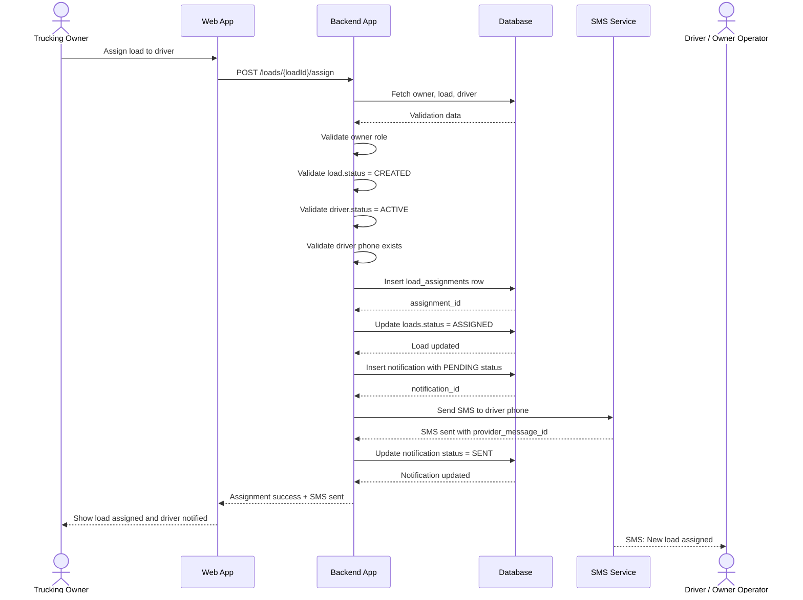
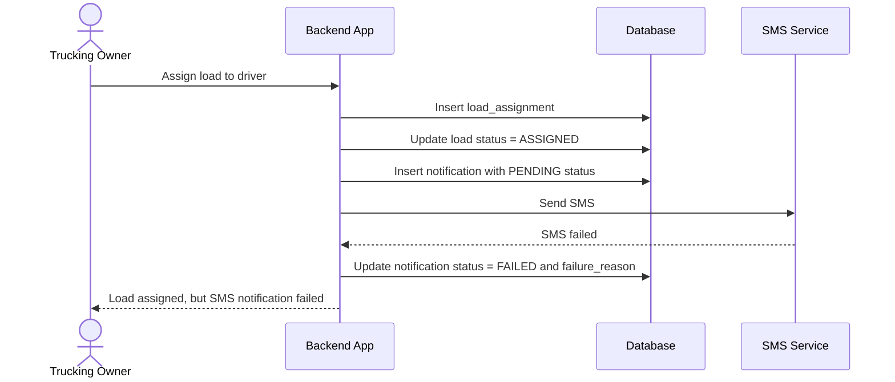

# Feature Spec: SMS Notification on Load Assignment

## Functional Requirement

Drivers / owner-operators should receive an SMS notification when a trucking owner assigns a load to them.

This feature extends the load assignment flow.

```text
Owner assigns load to driver
→ Backend creates assignment
→ Backend creates notification record
→ Backend calls SMS Service
→ SMS Service sends SMS to driver
→ Backend updates notification delivery status
```

## Actors / Components

- Trucking Owner / Company Owner
- Driver / Owner Operator
- Web App
- Backend App
- Database
- SMS Service

## Tables Used

Existing:

- `users`
- `companies`
- `drivers`
- `loads`
- `load_assignments`

New:

- `notifications`

## New Component: SMS Service

The SMS Service is responsible for sending SMS messages to drivers.

Possible providers:

```text
Twilio
AWS SNS
Any third-party SMS provider
```

For HLD and MVP implementation, keep it generic as `SMS Service`.

## Required DB Schema Update

Add a new `notifications` table.

```sql
CREATE TABLE notifications (
    id BIGSERIAL PRIMARY KEY,

    company_id BIGINT NOT NULL REFERENCES companies(id),
    recipient_user_id BIGINT REFERENCES users(id),
    recipient_phone VARCHAR(50),

    notification_type VARCHAR(100) NOT NULL,
    title VARCHAR(255) NOT NULL,
    message TEXT NOT NULL,

    related_load_id BIGINT REFERENCES loads(id),
    related_assignment_id BIGINT REFERENCES load_assignments(id),

    delivery_channel VARCHAR(50) DEFAULT 'SMS',
    delivery_status VARCHAR(50) DEFAULT 'PENDING',

    provider_message_id VARCHAR(255),
    failure_reason TEXT,

    read_status VARCHAR(50) DEFAULT 'UNREAD',

    created_at TIMESTAMP DEFAULT CURRENT_TIMESTAMP,
    sent_at TIMESTAMP,
    failed_at TIMESTAMP,
    read_at TIMESTAMP
);
```

## Notification Types

```text
LOAD_ASSIGNED
```

## Delivery Channels

```text
SMS
IN_APP
EMAIL
PUSH
```

For this feature, use:

```text
SMS
```

## Delivery Statuses

```text
PENDING
SENT
FAILED
```

Status usage:

```text
Before SMS call: delivery_status = PENDING
After SMS success: delivery_status = SENT
After SMS failure: delivery_status = FAILED
```

## Main Flow

1. Owner assigns a load to a driver.
2. Backend validates owner, load, driver, and payout details.
3. Backend creates `load_assignments` row.
4. Backend updates `loads.status = ASSIGNED`.
5. Backend creates `notifications` row with `delivery_status = PENDING`.
6. Backend calls SMS Service.
7. SMS Service sends SMS to driver's phone.
8. If SMS succeeds, backend updates notification as `SENT`.
9. If SMS fails, backend updates notification as `FAILED`.
10. Backend returns assignment response to owner.

## Existing API Updated

The existing assignment API remains the same.

```http
POST /api/v1/loads/{loadId}/assign
Content-Type: application/json
Authorization: Bearer <token>
```

### Request: Flat Amount

```json
{
  "driverId": 45,
  "payoutType": "FLAT_AMOUNT",
  "driverPayAmount": 1000.00,
  "notes": "Driver will handle pickup and delivery."
}
```

### Request: Percentage

```json
{
  "driverId": 45,
  "payoutType": "PERCENTAGE",
  "driverPayPercentage": 40.00,
  "notes": "Owner operator gets 40% of gross load revenue."
}
```

## Success Response: SMS Sent

```json
{
  "loadId": 301,
  "assignmentId": 9001,
  "driverId": 45,
  "notificationId": 7001,
  "loadStatus": "ASSIGNED",
  "assignmentStatus": "ASSIGNED",
  "notificationStatus": "SENT",
  "message": "Load assigned and SMS notification sent successfully."
}
```

## Partial Success Response: SMS Failed

Assignment should still succeed even if SMS fails.

```json
{
  "loadId": 301,
  "assignmentId": 9001,
  "driverId": 45,
  "notificationId": 7001,
  "loadStatus": "ASSIGNED",
  "assignmentStatus": "ASSIGNED",
  "notificationStatus": "FAILED",
  "message": "Load assigned successfully, but SMS notification failed."
}
```

## SMS Message Example

```text
New load assigned: LD-78901.
Pickup: Dallas, TX.
Drop-off: Chicago, IL.
Pickup date: 2026-06-25.
Open the app for details.
```

Keep SMS short.

## Backend Steps

```text
assignLoadToDriver(loadId, request, userId):

1. Validate authenticated user.
2. Validate user.role = OWNER.
3. Fetch load by loadId.
4. Validate load belongs to user's company.
5. Validate load.status = CREATED.
6. Fetch driver by request.driverId.
7. Validate driver belongs to same company.
8. Validate driver.status = ACTIVE.
9. Validate driver phone exists.
10. Validate payout details.
11. Start DB transaction.
12. Insert row into load_assignments.
13. Update loads.status = ASSIGNED.
14. Insert row into notifications with delivery_status = PENDING.
15. Commit DB transaction.
16. Call SMS Service.
17. If SMS succeeds:
      - Update notification.delivery_status = SENT
      - Save provider_message_id
      - Set sent_at = now()
18. If SMS fails:
      - Update notification.delivery_status = FAILED
      - Save failure_reason
      - Set failed_at = now()
19. Return assignment response.
```

## DB Write Pattern

### 1. Insert Assignment

```sql
INSERT INTO load_assignments (
    load_id,
    driver_id,
    assigned_by_user_id,
    payout_type,
    driver_pay_amount,
    driver_pay_percentage,
    assignment_status,
    notes,
    assigned_at
)
VALUES (
    :loadId,
    :driverId,
    :ownerUserId,
    :payoutType,
    :driverPayAmount,
    :driverPayPercentage,
    'ASSIGNED',
    :notes,
    CURRENT_TIMESTAMP
);
```

### 2. Update Load Status

```sql
UPDATE loads
SET status = 'ASSIGNED',
    updated_at = CURRENT_TIMESTAMP
WHERE id = :loadId;
```

### 3. Insert Notification Before SMS Call

```sql
INSERT INTO notifications (
    company_id,
    recipient_user_id,
    recipient_phone,
    notification_type,
    title,
    message,
    related_load_id,
    related_assignment_id,
    delivery_channel,
    delivery_status,
    read_status,
    created_at
)
VALUES (
    :companyId,
    :recipientUserId,
    :recipientPhone,
    'LOAD_ASSIGNED',
    'New Load Assigned',
    :message,
    :loadId,
    :assignmentId,
    'SMS',
    'PENDING',
    'UNREAD',
    CURRENT_TIMESTAMP
);
```

### 4. Update Notification After SMS Success

```sql
UPDATE notifications
SET delivery_status = 'SENT',
    provider_message_id = :providerMessageId,
    sent_at = CURRENT_TIMESTAMP
WHERE id = :notificationId;
```

### 5. Update Notification After SMS Failure

```sql
UPDATE notifications
SET delivery_status = 'FAILED',
    failure_reason = :failureReason,
    failed_at = CURRENT_TIMESTAMP
WHERE id = :notificationId;
```

## Sequence Diagram



## SMS Failure Flow



## Component Diagram

```mermaid
flowchart LR
    Owner[Trucking Owner] -->|Assign load| Web[Web App]
    Web -->|POST /loads/{loadId}/assign| Backend[Backend App]

    Backend -->|Validate owner/load/driver| DB[(Database)]
    Backend -->|Create load assignment| DB
    Backend -->|Create notification record| DB

    Backend -->|Send SMS request| SMS[SMS Service]
    SMS -->|SMS delivered| Driver[Driver / Owner Operator]

    SMS -->|Provider response| Backend
    Backend -->|Update notification status| DB
    Backend -->|Assignment response| Web
    Web -->|Show success/warning| Owner
```

## Validations

- User must be authenticated.
- User role must be `OWNER`.
- Load must belong to user's company.
- Load status must be `CREATED`.
- Driver must belong to user's company.
- Driver status must be `ACTIVE`.
- Driver phone must exist.
- Load must not already have an active assignment.
- Payout type must be valid.
- Payout value must match payout type.

## Important Design Rule

Do not roll back assignment if SMS fails.

Reason:

```text
Assignment is the main business action.
SMS is a notification side effect.
```

If SMS fails:

```text
load_assignments row remains
loads.status remains ASSIGNED
notifications.delivery_status = FAILED
owner sees warning
```

## Duplicate Notification Protection

Avoid duplicate SMS notification for the same assignment.

```sql
CREATE UNIQUE INDEX unique_load_assignment_notification
ON notifications(recipient_phone, related_assignment_id, notification_type)
WHERE notification_type = 'LOAD_ASSIGNED';
```

## Edge Cases

### Driver Phone Missing

Reject assignment:

```json
{
  "message": "Driver phone number is required for SMS notification."
}
```

### SMS Service Fails

Assignment succeeds, notification becomes failed:

```json
{
  "message": "Load assigned successfully, but SMS notification failed."
}
```

### Duplicate Assignment

Reject assignment:

```json
{
  "message": "Load is already assigned to a driver."
}
```

### Duplicate Notification

Do not send duplicate SMS for the same assignment.

## Implementation Notes

- Create assignment, update load status, and insert notification in one DB transaction.
- Call SMS Service after DB transaction commits.
- Store SMS provider response in `provider_message_id`.
- Store SMS failure reason in `failure_reason`.
- Driver phone can come from `drivers.phone` or linked `users.phone`; prefer `drivers.phone` for trucking-specific contact.
- Add retry support later for failed SMS notifications.
