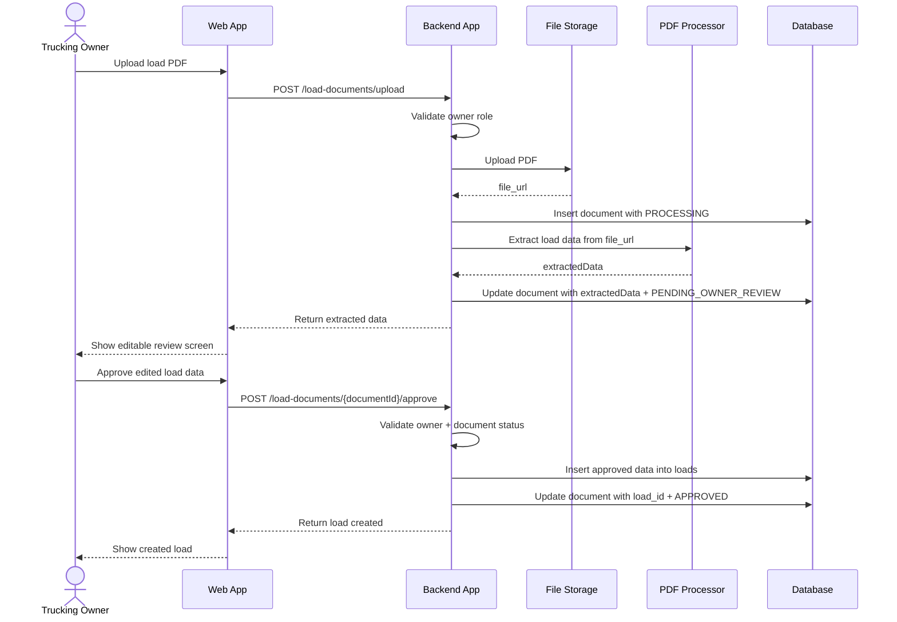

# Feature Spec: Owner Uploads Load Document

## Functional Requirement

Trucking owner can upload a load PDF. Backend extracts load data using PDF Processor, shows extracted data to owner for review, and only creates the final `loads` record after owner approval.

## Key Design Rule

PDF extraction must not directly create final load records.

Flow:

```text
Upload PDF
→ Store document metadata
→ Extract data
→ Save extracted data in documents table
→ Owner reviews/edits
→ Owner approves
→ Backend creates load record
→ Backend links document to load
```

## Actors / Components

- Trucking Owner
- Web App
- Backend App
- File Storage
- PDF Processor
- Database

## Tables Used

- `users`
- `companies`
- `documents`
- `loads`

## Required DB Schema Updates

Add these fields to `documents` if not already present:

```sql
approved_by_user_id BIGINT REFERENCES users(id),
approved_data JSONB,
approved_at TIMESTAMP
```

Recommended `documents` fields for this feature:

```sql
id BIGSERIAL PRIMARY KEY,
company_id BIGINT NOT NULL REFERENCES companies(id),
uploaded_by_user_id BIGINT REFERENCES users(id),
approved_by_user_id BIGINT REFERENCES users(id),
load_id BIGINT REFERENCES loads(id),
expense_id BIGINT REFERENCES expenses(id),
document_type VARCHAR(50) NOT NULL,
file_name VARCHAR(255),
file_url TEXT NOT NULL,
processing_status VARCHAR(50) DEFAULT 'PENDING',
extracted_data JSONB,
approved_data JSONB,
uploaded_at TIMESTAMP DEFAULT CURRENT_TIMESTAMP,
processed_at TIMESTAMP,
approved_at TIMESTAMP
```

## Document Statuses

```text
PENDING
PROCESSING
PENDING_OWNER_REVIEW
APPROVED
REJECTED
FAILED
```

## Main Flow

### 1. Upload Load Document

API:

```http
POST /api/v1/load-documents/upload
Content-Type: multipart/form-data
Authorization: Bearer <token>
```

Request:

```text
file: load-confirmation.pdf
documentType: LOAD_CONFIRMATION
```

Backend steps:

1. Validate authenticated user.
2. Validate user role is `OWNER`.
3. Upload PDF to file storage.
4. Insert document row with `processing_status = PROCESSING`.
5. Send file URL to PDF Processor.
6. Receive extracted load data.
7. Update document:
   - `extracted_data = extractedData`
   - `processing_status = PENDING_OWNER_REVIEW`
   - `processed_at = now()`
8. Return extracted data to UI for owner review.

Response:

```json
{
  "documentId": 501,
  "processingStatus": "PENDING_OWNER_REVIEW",
  "extractedData": {
    "loadNumber": "LD-78901",
    "brokerName": "ABC Logistics",
    "pickupLocation": "Dallas, TX",
    "dropoffLocation": "Chicago, IL",
    "pickupDate": "2026-06-25",
    "deliveryDate": "2026-06-27",
    "grossRevenue": 2500.00
  },
  "message": "Please review and approve the extracted load details."
}
```

### 2. Approve Load Document

API:

```http
POST /api/v1/load-documents/{documentId}/approve
Content-Type: application/json
Authorization: Bearer <token>
```

Request:

```json
{
  "loadNumber": "LD-78901",
  "brokerName": "ABC Logistics",
  "pickupLocation": "Dallas, TX",
  "dropoffLocation": "Chicago, IL",
  "pickupDate": "2026-06-25",
  "deliveryDate": "2026-06-27",
  "grossRevenue": 2500.00
}
```

Backend steps:

1. Validate authenticated user.
2. Validate user role is `OWNER`.
3. Fetch document by `documentId`.
4. Validate document belongs to owner’s company.
5. Validate document status is `PENDING_OWNER_REVIEW`.
6. Validate approved payload.
7. Insert row into `loads` using approved data.
8. Update document:
   - `load_id = createdLoadId`
   - `approved_by_user_id = ownerUserId`
   - `approved_data = requestBody`
   - `processing_status = APPROVED`
   - `approved_at = now()`
9. Return created load ID.

Response:

```json
{
  "documentId": 501,
  "loadId": 301,
  "processingStatus": "APPROVED",
  "message": "Load created successfully after owner approval."
}
```

### 3. Reject Load Document

Optional API:

```http
POST /api/v1/load-documents/{documentId}/reject
Authorization: Bearer <token>
```

Backend steps:

1. Validate owner.
2. Validate document belongs to owner’s company.
3. Update `documents.processing_status = REJECTED`.

Response:

```json
{
  "documentId": 501,
  "processingStatus": "REJECTED",
  "message": "Document rejected by owner."
}
```

## Sequence Diagram



## DB Write Pattern

Upload:

```sql
INSERT INTO documents (..., processing_status)
VALUES (..., 'PROCESSING');
```

After PDF extraction:

```sql
UPDATE documents
SET extracted_data = :extractedData,
    processing_status = 'PENDING_OWNER_REVIEW',
    processed_at = CURRENT_TIMESTAMP
WHERE id = :documentId;
```

After owner approval:

```sql
INSERT INTO loads (
    company_id,
    load_number,
    broker_name,
    pickup_location,
    dropoff_location,
    pickup_date,
    delivery_date,
    gross_revenue,
    status,
    created_at,
    updated_at
)
VALUES (
    :companyId,
    :loadNumber,
    :brokerName,
    :pickupLocation,
    :dropoffLocation,
    :pickupDate,
    :deliveryDate,
    :grossRevenue,
    'CREATED',
    CURRENT_TIMESTAMP,
    CURRENT_TIMESTAMP
);
```

Then:

```sql
UPDATE documents
SET load_id = :loadId,
    approved_by_user_id = :ownerUserId,
    approved_data = :approvedData,
    processing_status = 'APPROVED',
    approved_at = CURRENT_TIMESTAMP
WHERE id = :documentId;
```

## Validations

Upload API:

- User must be authenticated.
- User role must be `OWNER`.
- File must be PDF.
- Document type must be `LOAD_CONFIRMATION` or `RATE_CONFIRMATION`.

Approve API:

- User must be authenticated.
- User role must be `OWNER`.
- Document must belong to user's company.
- Document status must be `PENDING_OWNER_REVIEW`.
- Required approved fields:
  - `pickupLocation`
  - `dropoffLocation`
  - `grossRevenue`

Recommended additional fields:

- `loadNumber`
- `pickupDate`
- `deliveryDate`

## Edge Cases

### PDF Processor Fails

Update document:

```text
processing_status = FAILED
```

Return error message to owner.

### Owner Uploads Duplicate Load

Use unique index:

```sql
CREATE UNIQUE INDEX unique_company_load_number
ON loads(company_id, load_number)
WHERE load_number IS NOT NULL;
```

On approval, check if `company_id + load_number` already exists.

### Owner Edits Extracted Data

Store both versions:

```text
documents.extracted_data = original PDF extraction
documents.approved_data = final owner-approved values
loads = final business data only
```

## Implementation Notes

- Do not store PDF file binary in DB.
- Store PDF in file storage and save `file_url` in `documents`.
- Do not create `loads` row until owner approves.
- UI must show extracted fields in editable form.
- `loads.status` should be `CREATED` after approval.
