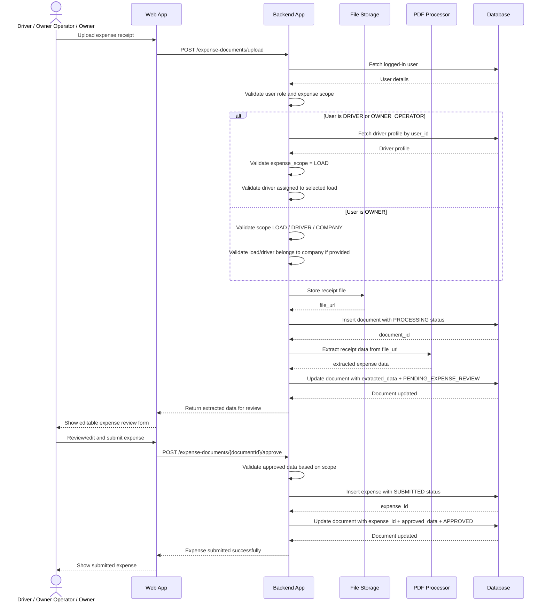

# Feature Spec: Expense Receipt Upload

## Functional Requirement

Drivers / owner-operators and trucking company owner should be able to upload expense receipts.

Expense receipts can be related to:

```text
LOAD
DRIVER
COMPANY
```

The system should process the receipt, extract expense data, allow review/edit, and create the final `expenses` record only after user approval/submission.

## Key Design Rule

Receipt extraction must not directly create final expense records.

Flow:

```text
Upload receipt
→ Store document metadata
→ Extract receipt data
→ Save extracted data in documents table
→ Uploader reviews/edits
→ Uploader submits/approves
→ Backend creates expense record
→ Backend links document to expense
```

## Actors / Components

- Driver
- Owner Operator
- Trucking Owner / Company Owner
- Web App
- Backend App
- File Storage
- PDF Processor
- Database

## Tables Used

- `users`
- `drivers`
- `loads`
- `load_assignments`
- `documents`
- `expenses`

## Supported Uploaders

```text
OWNER
DRIVER
OWNER_OPERATOR
```

## Expense Scopes

```text
LOAD
DRIVER
COMPANY
```

| Scope | Meaning | Example |
|---|---|---|
| `LOAD` | Expense belongs to a specific load | Fuel, toll, lumper |
| `DRIVER` | Expense belongs to a driver but not a load | Driver advance, driver hotel |
| `COMPANY` | General company-level expense | Insurance, permits, software |

## Important Business Rules

### Driver / Owner Operator Upload

For MVP:

```text
Driver / owner-operator can upload LOAD expenses only.
load_id is required.
Backend derives driver_id from logged-in user's driver profile.
Driver must be assigned to the selected load.
```

Important for owner-operator profit:

```text
Owner-operator uploaded expenses may be stored, but they should not reduce company-owner profit.
Owner-operator is responsible for their own expenses.
```

### Company Owner Upload

Company owner can upload:

```text
LOAD expenses
DRIVER expenses
COMPANY expenses
```

Rules:

```text
If expense_scope = LOAD:
    load_id is required.
    driver_id is optional.

If expense_scope = DRIVER:
    driver_id is required.
    load_id is optional.

If expense_scope = COMPANY:
    load_id and driver_id are optional/null.
```

## Required DB Schema Update

Update `expenses` to support optional load/driver links and expense scope.

```sql
CREATE TABLE expenses (
    id BIGSERIAL PRIMARY KEY,

    company_id BIGINT NOT NULL REFERENCES companies(id),

    load_id BIGINT REFERENCES loads(id),
    driver_id BIGINT REFERENCES drivers(id),
    submitted_by_user_id BIGINT NOT NULL REFERENCES users(id),

    expense_scope VARCHAR(50) NOT NULL,

    expense_type VARCHAR(100) NOT NULL,
    vendor_name VARCHAR(255),
    amount DECIMAL(12,2) NOT NULL,
    expense_date DATE,
    status VARCHAR(50) DEFAULT 'SUBMITTED',
    notes TEXT,

    created_at TIMESTAMP DEFAULT CURRENT_TIMESTAMP,
    updated_at TIMESTAMP DEFAULT CURRENT_TIMESTAMP
);
```

## Documents Table Usage

The existing `documents` table supports this feature.

Important fields:

```text
company_id
uploaded_by_user_id
approved_by_user_id
load_id
expense_id
document_type
file_name
file_url
processing_status
extracted_data
approved_data
uploaded_at
processed_at
approved_at
```

For receipt uploads:

```text
documents.document_type = EXPENSE_RECEIPT
documents.expense_id = null until expense is approved/submitted
```

## Document Statuses

Use:

```text
PENDING
PROCESSING
PENDING_EXPENSE_REVIEW
APPROVED
REJECTED
FAILED
```

Meaning:

```text
PROCESSING = receipt uploaded and being processed
PENDING_EXPENSE_REVIEW = extraction complete, waiting for uploader review
APPROVED = uploader submitted expense and expense row was created
FAILED = receipt extraction failed
```

## Expense Statuses

Use:

```text
SUBMITTED
APPROVED
REJECTED
NEEDS_REVIEW
```

For this feature:

```text
After uploader submits reviewed expense:
    expenses.status = SUBMITTED
```

Owner approval of submitted expenses can be handled in a later requirement.

## Extracted Expense Fields

PDF Processor should attempt to extract:

```text
expense_type
vendor_name
amount
expense_date
receipt_number
```

Optional/manual fields:

```text
load_id
driver_id
expense_scope
notes
```

Receipt may not contain load/driver context, so UI should allow user to select it.

## Required Fields for Final Expense Submission

Common required fields:

```text
expense_scope
expense_type
amount
expense_date
```

Scope-specific required fields:

```text
LOAD:
    load_id required

DRIVER:
    driver_id required

COMPANY:
    no load_id or driver_id required
```

## API: Upload Expense Receipt

```http
POST /api/v1/expense-documents/upload
Content-Type: multipart/form-data
Authorization: Bearer <token>
```

Request:

```text
file: receipt.pdf
documentType: EXPENSE_RECEIPT
expenseScope: LOAD | DRIVER | COMPANY
loadId: optional
driverId: optional
```

### Example: Driver Uploads Load Expense

```text
file: fuel-receipt.pdf
documentType: EXPENSE_RECEIPT
expenseScope: LOAD
loadId: 301
```

Driver ID is derived by backend from logged-in user.

### Example: Owner Uploads Company Expense

```text
file: insurance.pdf
documentType: EXPENSE_RECEIPT
expenseScope: COMPANY
```

### Example: Owner Uploads Driver Expense

```text
file: driver-advance.pdf
documentType: EXPENSE_RECEIPT
expenseScope: DRIVER
driverId: 45
```

### Example: Owner Uploads Load Expense

```text
file: toll.pdf
documentType: EXPENSE_RECEIPT
expenseScope: LOAD
loadId: 301
driverId: 45 optional
```

### Upload Response

```json
{
  "documentId": 801,
  "processingStatus": "PENDING_EXPENSE_REVIEW",
  "extractedData": {
    "expenseType": "FUEL",
    "vendorName": "Pilot",
    "amount": 420.75,
    "expenseDate": "2026-06-27"
  },
  "message": "Please review and submit the extracted expense details."
}
```

## API: Approve / Submit Expense Receipt

```http
POST /api/v1/expense-documents/{documentId}/approve
Content-Type: application/json
Authorization: Bearer <token>
```

### Request: Load Expense

```json
{
  "expenseScope": "LOAD",
  "loadId": 301,
  "driverId": 45,
  "expenseType": "FUEL",
  "vendorName": "Pilot",
  "amount": 420.75,
  "expenseDate": "2026-06-27",
  "notes": "Fuel receipt for assigned load."
}
```

### Request: Company Expense

```json
{
  "expenseScope": "COMPANY",
  "expenseType": "INSURANCE",
  "vendorName": "Progressive",
  "amount": 1200.00,
  "expenseDate": "2026-06-27",
  "notes": "Monthly insurance payment."
}
```

### Success Response

```json
{
  "documentId": 801,
  "expenseId": 1001,
  "processingStatus": "APPROVED",
  "expenseStatus": "SUBMITTED",
  "message": "Expense submitted successfully."
}
```

## Upload Flow

```text
1. User uploads receipt.
2. Backend validates user role.
3. Backend validates expense scope.
4. Backend validates load/driver context if provided.
5. Backend uploads file to storage.
6. Backend inserts document with PROCESSING status.
7. Backend calls PDF Processor.
8. PDF Processor returns extracted receipt data.
9. Backend updates document with extracted_data and PENDING_EXPENSE_REVIEW.
10. UI shows editable expense review form.
```

## Approval / Submission Flow

```text
1. User reviews and edits extracted expense details.
2. User submits expense.
3. Backend validates document ownership and status.
4. Backend validates approved expense data.
5. Backend validates scope-specific rules.
6. Backend inserts expense row with SUBMITTED status.
7. Backend updates document with expense_id, approved_data, APPROVED status.
8. Backend returns expense submission response.
```

## Sequence Diagram



## DB Write Pattern

### 1. Insert Document on Upload

```sql
INSERT INTO documents (
    company_id,
    uploaded_by_user_id,
    document_type,
    file_name,
    file_url,
    processing_status,
    uploaded_at
)
VALUES (
    :companyId,
    :uploadedByUserId,
    'EXPENSE_RECEIPT',
    :fileName,
    :fileUrl,
    'PROCESSING',
    CURRENT_TIMESTAMP
);
```

### 2. Update Document After Extraction

```sql
UPDATE documents
SET extracted_data = :extractedData,
    processing_status = 'PENDING_EXPENSE_REVIEW',
    processed_at = CURRENT_TIMESTAMP
WHERE id = :documentId;
```

### 3. Insert Expense After User Approval

```sql
INSERT INTO expenses (
    company_id,
    load_id,
    driver_id,
    submitted_by_user_id,
    expense_scope,
    expense_type,
    vendor_name,
    amount,
    expense_date,
    status,
    notes,
    created_at,
    updated_at
)
VALUES (
    :companyId,
    :loadId,
    :driverId,
    :submittedByUserId,
    :expenseScope,
    :expenseType,
    :vendorName,
    :amount,
    :expenseDate,
    'SUBMITTED',
    :notes,
    CURRENT_TIMESTAMP,
    CURRENT_TIMESTAMP
);
```

### 4. Update Document After Expense Creation

```sql
UPDATE documents
SET expense_id = :expenseId,
    approved_by_user_id = :submittedByUserId,
    approved_data = :approvedData,
    processing_status = 'APPROVED',
    approved_at = CURRENT_TIMESTAMP
WHERE id = :documentId;
```

## Validation Rules

### Common Upload Validations

```text
User must be authenticated.
User role must be OWNER, DRIVER, or OWNER_OPERATOR.
File must be PDF/JPG/JPEG/PNG.
document_type must be EXPENSE_RECEIPT.
company_id must come from logged-in user.
```

### Driver / Owner-Operator Upload Validations

```text
Fetch driver profile using user.id.
Driver profile must exist.
Driver status must be ACTIVE.
expense_scope must be LOAD.
load_id is required.
Driver must be assigned to selected load.
driver_id is derived from driver profile, not request body.
```

Assignment validation query:

```sql
SELECT id
FROM load_assignments
WHERE load_id = :loadId
  AND driver_id = :driverId
  AND assignment_status IN ('ASSIGNED', 'ACCEPTED', 'IN_PROGRESS', 'COMPLETED');
```

### Owner Upload Validations

```text
Owner can upload LOAD, DRIVER, or COMPANY expenses.
If load_id is provided, load must belong to owner's company.
If driver_id is provided, driver must belong to owner's company.
For COMPANY scope, load_id and driver_id can be null.
```

## Expense Scope Validation

```text
If expense_scope = LOAD:
    load_id is required.

If expense_scope = DRIVER:
    driver_id is required.

If expense_scope = COMPANY:
    load_id and driver_id should be null unless later business logic supports allocation.
```

## Edge Cases

### Receipt Extraction Fails

Set:

```text
documents.processing_status = FAILED
```

Response:

```json
{
  "documentId": 801,
  "processingStatus": "FAILED",
  "message": "Could not extract receipt details. Please enter expense manually."
}
```

### Missing Amount

Do not create expense automatically.

Set:

```text
documents.processing_status = PENDING_EXPENSE_REVIEW
```

Uploader must enter amount manually before submission.

### Driver Selects Load Not Assigned to Them

Reject:

```json
{
  "message": "You can only submit expenses for loads assigned to you."
}
```

### Owner Uploads Expense for Another Company's Driver

Reject:

```json
{
  "message": "Driver does not belong to your company."
}
```

### Duplicate Receipt Uploaded

For MVP, allow duplicate but consider showing warning.

Future duplicate detection can use:

```text
file_hash
amount
vendor_name
expense_date
driver_id
load_id
```

## Profit Calculation Impact

Expense scope affects profit calculations.

```text
LOAD expenses:
    Affect load/company profit only when load is assigned to COMPANY_DRIVER.
    Do not affect company-owner profit for OWNER_OPERATOR loads.

DRIVER expenses:
    Affect company profit only for COMPANY_DRIVER drivers.
    Do not affect company-owner profit for OWNER_OPERATOR drivers.

COMPANY expenses:
    Affect company-level profit.
```

Important:

```text
Owner-operator expenses should not reduce company-owner profit.
Owner-operators are responsible for their own expenses.
```

## Implementation Notes

```text
Do not store receipt binary in DB.
Store receipt in file storage and save file_url in documents.
Do not create expenses row until uploader approves/submits reviewed data.
Use PENDING_EXPENSE_REVIEW for both owner and driver expense review.
Use submitted_by_user_id to track who uploaded/submitted the expense.
Use expense_scope to decide profit calculation behavior.
```
