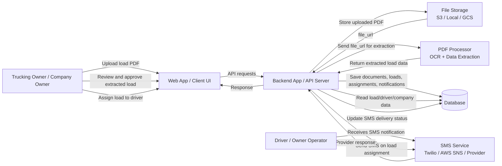
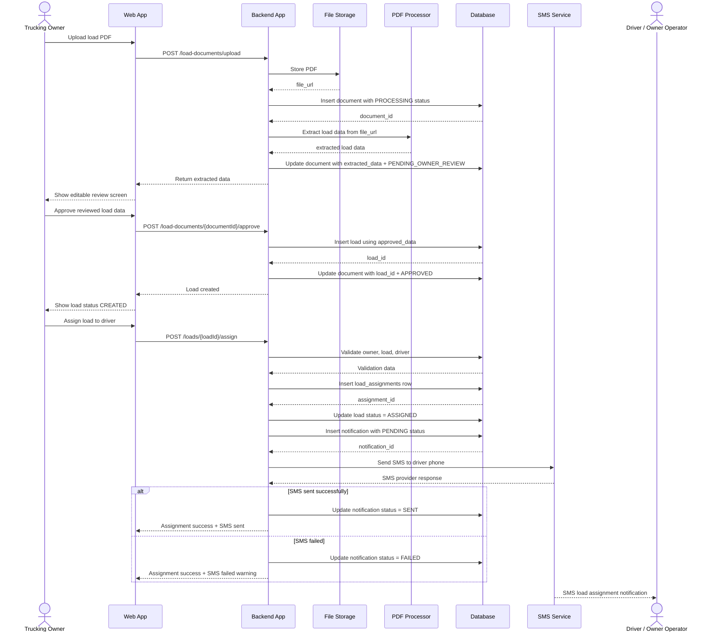
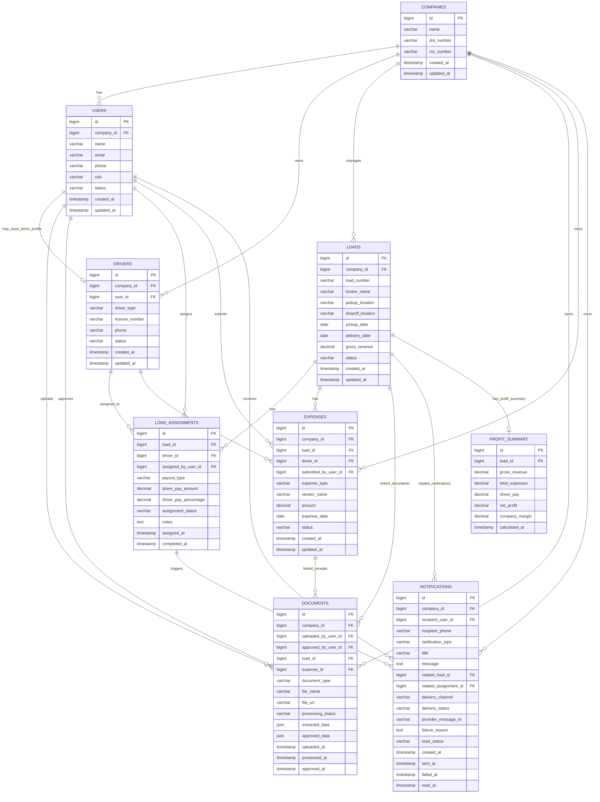

# Trucking Driver Management App - Updated HLD and ER Design

## Scope

This document captures the current overall application design based on the functional requirements finalized so far.

## Functional Requirements Covered

```text
1. Trucking owner uploads load document.
2. Backend extracts data using PDF Processor.
3. Owner reviews/approves extracted load data.
4. Backend creates final load record only after approval.
5. Owner assigns approved load to driver / owner-operator.
6. Driver receives SMS notification on load assignment.
```

---

## 1. Updated Overall HLD



---

## 2. Component Responsibilities

### Client / Web App

Used by:

```text
Trucking Owner
Driver / Owner Operator
```

Owner can:

```text
Upload load PDF
Review extracted load data
Approve load data
Assign load to driver
See assignment/SMS status
```

Driver can:

```text
Receive SMS notification
Later open app and view assigned loads
```

---

### Backend App

Main business logic layer.

Responsibilities:

```text
Authenticate users
Validate owner permissions
Handle load PDF upload
Store document metadata
Call PDF Processor
Store extracted data
Wait for owner approval
Create final load record
Assign load to driver
Create notification record
Call SMS Service
Update SMS delivery status
```

---

### File Storage

Stores uploaded PDFs.

Examples:

```text
AWS S3
Google Cloud Storage
Firebase Storage
Local storage for MVP
```

DB stores only:

```text
file_url
file_name
document metadata
```

---

### PDF Processor

Extracts load data from uploaded documents.

Extracted fields:

```text
load_number
broker_name
pickup_location
dropoff_location
pickup_date
delivery_date
gross_revenue
```

Important rule:

```text
PDF Processor output is not final business data.
Owner approval is required before creating load.
```

---

### Database

Stores:

```text
companies
users
drivers
documents
loads
load_assignments
notifications
expenses
profit_summary
```

Current requirements mainly use:

```text
companies
users
drivers
documents
loads
load_assignments
notifications
```

---

### SMS Service

Sends SMS to driver when load is assigned.

Examples:

```text
Twilio
AWS SNS
Any SMS provider
```

Backend stores SMS result in `notifications`.

---

## 3. Overall Functional Flow

### Flow 1: Owner Uploads Load Document

```text
Owner uploads PDF
→ Backend stores file in storage
→ Backend creates documents row
→ Backend sends file to PDF Processor
→ PDF Processor extracts data
→ Backend stores extracted_data in documents
→ document status = PENDING_OWNER_REVIEW
→ Owner reviews extracted data
```

---

### Flow 2: Owner Approves Load

```text
Owner edits/reviews extracted data
→ Owner clicks approve
→ Backend validates approved data
→ Backend creates loads row
→ Backend updates documents row with approved_data and load_id
→ document status = APPROVED
→ load status = CREATED
```

---

### Flow 3: Owner Assigns Load to Driver

```text
Owner selects CREATED load
→ Owner selects ACTIVE driver
→ Owner enters payout type/details
→ Backend validates load and driver
→ Backend creates load_assignments row
→ Backend updates load status = ASSIGNED
```

---

### Flow 4: Driver Gets SMS Notification

```text
After assignment created
→ Backend creates notifications row with PENDING status
→ Backend calls SMS Service
→ SMS Service sends SMS
→ Backend updates notification status = SENT or FAILED
```

---

## 4. Updated Overall Sequence Diagram



---

## 5. Updated Overall ER Diagram



---

## 6. Current DB Schema Summary

### Core Tables Right Now

```text
companies
users
drivers
documents
loads
load_assignments
notifications
```

### Future/Profit Related Tables Already Planned

```text
expenses
profit_summary
```

Keep `expenses` and `profit_summary` in the overall ER diagram because net profit is part of the product idea, but these will become more important when discussing:

```text
Driver uploads expense receipts
Owner assigns profit margin / payout
System calculates profit
```

---

## 7. Current Status Values

### `documents.processing_status`

```text
PENDING
PROCESSING
PENDING_OWNER_REVIEW
APPROVED
REJECTED
FAILED
```

### `loads.status`

```text
CREATED
ASSIGNED
IN_PROGRESS
DELIVERED
COMPLETED
CANCELLED
```

### `load_assignments.assignment_status`

```text
ASSIGNED
CANCELLED
COMPLETED
```

Future:

```text
ACCEPTED
REJECTED
IN_PROGRESS
```

### `notifications.delivery_status`

```text
PENDING
SENT
FAILED
```

### `notifications.delivery_channel`

```text
SMS
IN_APP
EMAIL
PUSH
```

For current requirement:

```text
SMS
```

---

## 8. Important Current Design Rules

```text
1. PDF file is stored in file storage, not directly in DB.

2. documents.extracted_data stores raw PDF Processor output.

3. documents.approved_data stores final owner-reviewed data.

4. loads row is created only after owner approval.

5. Load can be assigned only when loads.status = CREATED.

6. One load can have one active assignment for MVP.

7. Assignment creates load_assignments row.

8. Assignment updates loads.status = ASSIGNED.

9. SMS notification is sent after assignment is created.

10. SMS failure should not roll back load assignment.

11. SMS success/failure is tracked in notifications table.
```
